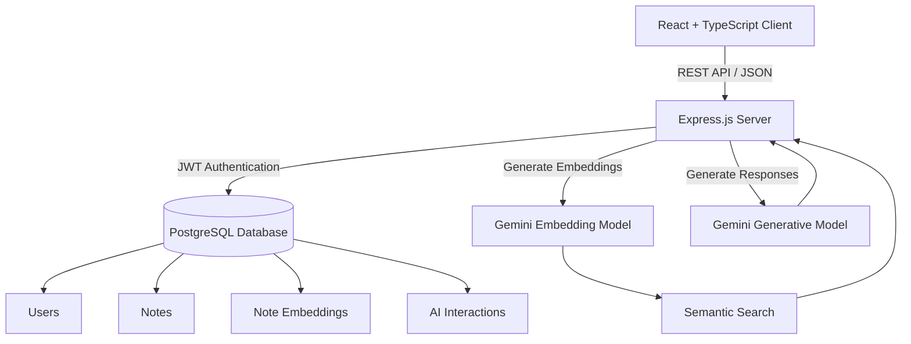

# 🧠 MemoraAI

MemoraAI is a full-stack AI-powered knowledge management application that helps users create, organize, search, and interact with their personal notes. It uses **semantic vector search and Retrieval-Augmented Generation (RAG)** to provide AI-powered answers based on the user's stored knowledge.

🚀 **Live Demo:** https://memora-ai-zeta.vercel.app

📂 **GitHub Repository:** https://github.com/Prachi-2407/memora-ai

---

## ✨ Features

### 🤖 AI Knowledge Assistant

- Ask questions about your personal notes
- Semantic search using vector embeddings
- Retrieval-Augmented Generation (RAG) for context-aware responses
- Source citations showing the notes used for an answer
- AI interaction history stored in PostgreSQL

### 📝 AI Note Assistant

- Automatic tag generation
- AI-powered title generation
- Note summarization with TL;DR
- Writing improvement and grammar correction
- Markdown formatting assistance

### 📚 Note Management

- Create and edit notes
- Delete and restore notes
- Permanently delete notes
- Mark notes as favorites
- Search notes by title and content
- Filter notes using tags

### 🔐 User Authentication

- User registration and login
- JWT-based authentication
- Password hashing using bcryptjs
- Protected API routes
- User-specific notes and AI interactions

### 🎨 User Interface

- Responsive design
- Light and dark themes
- Persistent theme preference using `localStorage`
- Clean card-based note interface
- Mobile-friendly layouts
- Notification center for note activity

---

## 🧠 Retrieval-Augmented Generation

MemoraAI uses a Retrieval-Augmented Generation (RAG) pipeline to generate responses based on the user's own notes.

```text
User Question
      ↓
Generate Query Embedding
      ↓
Semantic Similarity Search
      ↓
Retrieve Relevant Notes
      ↓
Send Context to Gemini
      ↓
Generate AI Response
      ↓
Display Answer + Sources
```

### How It Works

1. The user's question is converted into a vector embedding.
2. The embedding is compared with stored note embeddings.
3. The most relevant notes are retrieved using semantic similarity.
4. The retrieved notes are provided to the Gemini model as context.
5. Gemini generates a response based on the retrieved information.
6. Relevant source notes are displayed with the response.
7. The question and generated answer are stored in PostgreSQL.

---

## 🏗️ System Architecture



---

## 🛠️ Tech Stack

### Frontend

- React 19
- TypeScript
- Vite
- HTML5
- CSS3
- JavaScript

### Backend

- Node.js
- Express.js
- TypeScript
- REST API

### Database

- PostgreSQL
- Neon PostgreSQL
- `pg`

### Authentication

- JSON Web Tokens (JWT)
- bcryptjs

### AI

- Google Gemini
- Gemini Embeddings
- Retrieval-Augmented Generation (RAG)
- Cosine Similarity

### Other Tools & Libraries

- Google GenAI SDK
- CORS
- Dotenv
- Vercel
- Render

---

## 📂 Project Structure

```text
memora-ai/
│
├── client/
│   ├── src/
│   │   ├── components/
│   │   ├── pages/
│   │   ├── services/
│   │   ├── hooks/
│   │   └── ...
│   ├── public/
│   ├── package.json
│   └── vite.config.ts
│
├── server/
│   ├── src/
│   │   ├── controllers/
│   │   ├── routes/
│   │   ├── middleware/
│   │   ├── services/
│   │   ├── database/
│   │   └── ...
│   ├── package.json
│   └── tsconfig.json
│
├── package.json
└── README.md
```

---

## 🗄️ Database Structure

MemoraAI uses PostgreSQL with four primary tables.

### `users`

Stores user account and authentication information.

### `notes`

Stores note content, tags, favorites, deletion status, and timestamps.

### `note_embeddings`

Stores vector embeddings associated with notes for semantic search.

### `ai_interactions`

Stores questions asked by users and AI-generated responses.

### Database Relationship

```text
users
 │
 ├─────────────── notes
 │                    │
 │                    └── note_embeddings
 │
 └─────────────── ai_interactions
```

---

## 🚀 Installation

### Prerequisites

Make sure the following are installed:

- Node.js 18 or higher
- PostgreSQL
- Git
- Google Gemini API key

### Clone the Repository

```bash
git clone https://github.com/Prachi-2407/memora-ai.git
cd memora-ai
```

---

## Backend Setup

Navigate to the server directory:

```bash
cd server
npm install
```

Create a `.env` file inside the `server` directory:

```env
PORT=5001

DATABASE_URL=your_postgresql_connection_string

JWT_SECRET=your_jwt_secret

GEMINI_API_KEY=your_gemini_api_key

GEMINI_MODEL=your_gemini_model

GEMINI_EMBEDDING_MODEL=your_embedding_model
```

---

## Database Setup

Create a PostgreSQL database named `memoraai`.

Run the database schema:

```bash
psql -d memoraai -f src/database/schema.sql
```

Make sure your `DATABASE_URL` points to the correct PostgreSQL database.

---

## Start the Backend

```bash
npm run dev
```

Backend runs on:

```text
http://localhost:5001
```

---

## Frontend Setup

Open a new terminal and navigate to the client directory:

```bash
cd client
npm install
```

Create a `.env` file inside the `client` directory:

```env
VITE_API_URL=http://127.0.0.1:5001/api
```

---

## Start the Frontend

```bash
npm run dev
```

Frontend runs on:

```text
http://localhost:5173
```

Open the application in your browser:

```text
http://localhost:5173
```

---

## 🔑 Environment Variables

### Backend

| Variable | Description |
|---|---|
| `PORT` | Backend server port |
| `DATABASE_URL` | PostgreSQL connection string |
| `JWT_SECRET` | Secret used for JWT authentication |
| `GEMINI_API_KEY` | Google Gemini API key |
| `GEMINI_MODEL` | Gemini generative model |
| `GEMINI_EMBEDDING_MODEL` | Gemini embedding model |

### Frontend

| Variable | Description |
|---|---|
| `VITE_API_URL` | Backend API URL |

> **Important:** Never commit `.env` files or expose API keys in the repository.

---

## 📸 Screenshots

Add your application screenshots here.

### Dashboard


### AI Assistant


### Note Editor


### Dark Mode


---

## 🌐 Deployment

MemoraAI is deployed using multiple cloud services.

| Service | Platform | Purpose |
|---|---|---|
| Frontend | Vercel | React application |
| Backend | Render | Express API |
| Database | Neon | PostgreSQL database |
| AI Services | Google Gemini | AI generation and embeddings |

### Live Application

🚀 https://memora-ai-zeta.vercel.app

### Backend API Health Check

🔗 https://memora-ai-whmx.onrender.com/api/health

---

## 📚 Key Learnings

- Built a full-stack application using React, TypeScript, Node.js, and PostgreSQL.
- Implemented JWT-based authentication and protected API routes.
- Designed RESTful APIs using Express.js.
- Integrated Google Gemini for generative AI features.
- Implemented vector embeddings for semantic search.
- Built a Retrieval-Augmented Generation (RAG) workflow.
- Stored and retrieved AI interaction history using PostgreSQL.
- Implemented AI-assisted note organization and writing tools.
- Deployed the frontend, backend, and database using cloud platforms.
- Managed application secrets using environment variables.

---

## 🚀 Future Enhancements

- [ ] Advanced semantic search
- [ ] PDF and document upload
- [ ] PostgreSQL `pgvector` integration
- [ ] Streaming AI responses
- [ ] Note version history
- [ ] AI-generated knowledge graphs
- [ ] Collaborative workspaces
- [ ] RAG evaluation and monitoring
- [ ] Automated testing
- [ ] CI/CD pipeline
- [ ] Improved search and filtering
- [ ] File-based knowledge ingestion

---

## 🔒 Security Considerations

- Store API keys in environment variables.
- Never commit `.env` files.
- Use a strong and unique JWT secret.
- Validate incoming API requests.
- Restrict CORS to trusted origins in production.
- Use HTTPS for production deployments.
- Apply appropriate database access controls.

---

## 👩‍💻 Author

**Prachi**

- GitHub: https://github.com/Prachi-2407
- Repository: https://github.com/Prachi-2407/memora-ai

---

## 📄 License

This project is developed for **learning purposes and personal portfolio use**.
